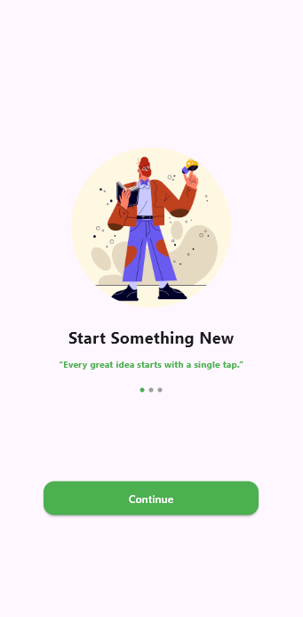
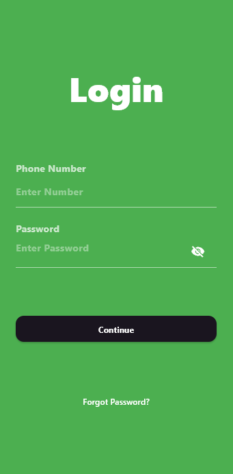

# 🎯 UTS Flutter — Membuat tampilan/UI Splash Screen dan Login Page

Tugas Ujian Tengah Semester mata kuliah **Mobile App**.  
Aplikasi ini menampilkan Splash Screen dan Login Page dengan desain modern menggunakan Flutter.

---

## 📸 Hasil Screenshot



---

## 👤 Identitas
| Keterangan | Data |
|-------------|------|
| **Nama Lengkap** | Ari Firmansyah |
| **NIM** | 1123150127 |

---

## 🚀 Cara Menjalankan Project

> Pastikan sudah menginstal **Flutter SDK** minimal versi **3.x.x**

1. Clone atau download repository project ini:
   ```bash
   git clone https://github.com/Mansyahariii/KB1179-1123150127-uts
   cd KB1179-1123150127-uts
   ````

2. Install semua dependency:

   ```bash
   flutter pub get
   ```

3. Jalankan project di device atau emulator:

   ```bash
   flutter run
   ```

---

## 🧠 Catatan Kendala

Ada kendala pada LoginScreen saat mencoba membuat 2 tombol (tombol OTP dan tombol Continue), tidak bisa menggunakan 'width: double.infinity'.
Selebihnya aman sentosa.

---

✨ *Dibuat dengan senang hati, pegel pegel dikit.*
